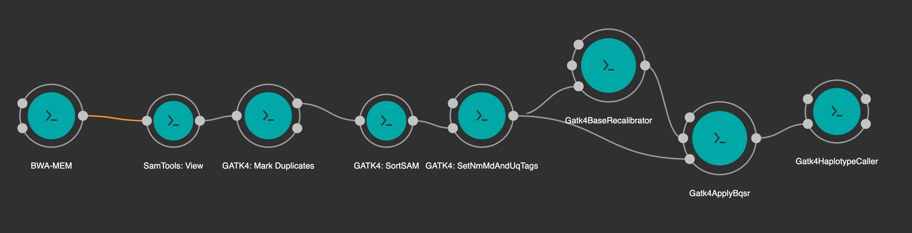

# Janis Workshop (1.2)

## Introduction to Janis

Janis is workflow framework that uses Python to construct a declarative workflow. It has a simple workflow API within Python that you use to build your workflow. Janis converts your pipeline to the Common Workflow Language (CWL) or Workflow Description Language (WDL) for execution, which can then be published, shared or archived. 

This workshop uses a bioinformatics focus example, but Janis is a generic workflow assistant and can be used outside of the computational genomics.

- Janis GitHub: https://github.com/PMCC-BioinformaticsCore/janis
- Janis Documentation: https://janis.readthedocs.io/en/latest

## Foundations

- A workflow is a collection of tools that are run in an organised manner.

- A workflow specification is a format that exactly describes the relationship between your tools. Popular workflow specification types include:

    - Common Workflow Language (CWL)
    - Workflow Description Language (WDL)
    - [_Unsupported_] Nextflow
    - [_Unsupported_] Snakemake

- YAML (.yml) is a file-format for specifying key-value pairs (like a dictionary). YAML is very similar to, and is in fact a superset of JSON.

### What is Janis

Janis is a project that aims to address two questions:

- How do we build pipelines that can run everywhere?
- How can we make running pipelines easier?

In fact, Janis is actually split into two components that addresses these questions separately:

- `janis-core` - Helps users **build** portable pipelines using existing workflow **specifications**.
- `janis-assistant` - Helps users **run** pipelines using existing workflow **engines**.

### Fundamental features

- Janis uses an _abstracted execution environment_ which removes the shared file system you may be used to in other pipelineing systems.

    - For a file or directory to be available to your tool, you need to EXPLICITLY include it. 
        - This includes associated files, if you want an indexed bam, you must use the BamBai type. 

    - Outputs of a _tool_ must be EXPLICITLY collected to be used by future steps, else they will be removed.

    - Outputs of a workflow must be EXPLICITLY collected.

    - A step's requirements (its inputs) can be an input to a workflow, or the output of a previous step (hence creating a dependency).

        

- In Janis, all tasks are executed inside a isolated virtual environment called a [_Container_](https://www.docker.com/resources/what-container). Docker and Singularity are two common container types. (Docker containers can be executed by Singularity.)

### Setup

A virtual environment is the best way to install Janis. It contains all the dependencies separately, and avoid polluting your local Python installation. It also preserves the version of Janis in a reproducible way.

1. Create an activate a virtualenv:

    ```bash
    # create virtual env at $(pwd)/janis/env
    python3 -m venv janis/env

    # source the virtual env
    source janis/env/bin/activate
    ```


2. Install Janis through PIP:

    ```bash
    pip install janis-pipelines
    ```

3. Test that Janis (and associated modules) were installed:

    ```bash
    janis -v
    #--------------------  -------
    #janis-core            v0.11.x
    #janis-assistant       v0.11.x
    #janis-templates       v0.11.x
    #janis-unix            v0.11.x
    #janis-bioinformatics  v0.11.x
    #janis-pipelines       v0.11.x
    #--------------------  -------
    ```

#### Download data

We will start with downloading all the test data required for this workshop. For consistency, we will use a directory called `portable-pipeline`. In this workshop, we use:

- A test sample based on [Genome-In-A-Bottle NA12878](https://github.com/genome-in-a-bottle/giab_data_indexes), with reads being cut down to a single gene region (chr17:43044045-43125733)
- A test reference genome (and other resource bundle databases) derived from human HG38 reference provided by [GATK Resource Bundle]( https://console.cloud.google.com/storage/browser/genomics-public-data/references/hg38/v0/), cut down to a single gene region (chr17:43044045-43125733).

```bash
# You might see warnings when untarring this workshop data due
# to a difference of tar versions when archiving on macOS.


mkdir portable-pipeline && cd portable-pipeline

wget -q -O- "https://github.com/PMCC-BioinformaticsCore/janis-workshops/raw/master/portable-pipeline/resources/data.tar" \
    | tar -xz
```

The download contains folders for data, references and the solutions. You can confirm this with:

```bash
ls -lGh
drwxr-xr-x 2 ec2-user  119 Jul 17 13:18 data
drwxr-xr-x 2 ec2-user   63 Jul 17 13:18 day1
drwxr-xr-x 2 ec2-user  104 Jul 17 13:18 day2
drwxr-xr-x 2 ec2-user 4.0K Jul 17 03:36 reference
```

### Setting up Janis 

Next, let's initialise our Janis environment. This step is only required on the first time we setup Janis on a new environment.

```bash
janis init local 
```

Running this command will create a configuration file at `~/.janis/janis.conf`.

We'll use a text editor to the first line in our template from `engine: cromwell` to `engine: cwltool`:


```bash
vim ~/.janis/janis.conf
```

The file should be:

```yaml
engine: cwltool
notifications:
  email: null
template:
  id: local
```

Janis will automatically use the config for the rest of the workshop. Although we've used the `local` template, you could instead use `singularity` or use an advanced configuration (like `slurm_singularity` or `pbs_singularity`), important when used in High Performance Computing (HPC) environments. 

### How does Janis run a workflow?

Janis leverages community driven engines to run workflows. For this workshop, we will use the [cwltool](https://github.com/common-workflow-language/cwltool) execution engine to run translated Janis workflow (in Common Workflow Language [CWL](https://www.commonwl.org/)) using Dockerised tools. CWLTool is automatically installed with the Janis assistant.

For our tests, Janis will:

- Convert an example workflow to CWL,
- Run the CWL workflow with cwltool,
- Watch the progress of the workflow,
- Copy the outputs, and remove the execution directory on success.

It's important to note that building workflows in Janis does NOT limit you to running with Janis. You are free to take the exported CWL and WDL specifications to run your workflow on your own platform.


### Running a simple test workflow 

To test that Janis is configured properly, we will run a simple workflow called [`Hello`](https://janis.readthedocs.io/en/latest/tools/unix/hello.html) (click the link to see the documentation). We'll supply an input called `inp`, with value `"Hello, World"`, this will get printed to stdout, and this stdout is captured as an output. This will test that Janis can run in your environment correctly. 

We must specify an output directory (`-o`) to contain the execution and outputs, we'll ask Janis to output our results to a subdirectory called `part1`. 

```bash
janis run -o part1 hello --inp "Hello, World"
```

This command will:

- Create an output directory called `part1` (relative to the current directory)
- Convert `hello` Janis workflow to `hello` CWL workflow
- Submit workflow to the cwltool and run a task that calls "echo"
- Collect the results

You will see logs from cwltool in the terminal. There is a number of statements that are worth highlighting:

```bash
... [INFO]: Starting task with id = 'a6acf2'
... [INFO]: CWLTool has started with pid=41562
... # Selected CWLTool logs
... [INFO]: Task has finished with status: Completed
... [INFO]: View the task outputs: file:///<path>/part1/
```

We can track the progress of our workflow with:

```bash
janis watch part1/
```

You will see a progress screen like the following 

```
SID:        a6acf2
EngId:      a6acf2
Engine:     cwltool

Task Dir:   /Users/franklinmichael/Desktop/tmp/janis/part1

Status:     completed
Duration:   9s
Start:      2020-07-15T08:14:01.408996+00:00
Finish:     2020-07-15T08:14:09.941033+00:00
Updated:    1m:05s ago (2020-07-15T08:14:09+00:00)

Jobs: 
        [✓] hello (7s)   

Outputs:
    - out: $HOME/part1/out
```


In our output folder, there are two items (`ls part1`):
```
drwxr-sr-x 8 mfranklin 133K Jan 31 12:59 janis
-rw-r--r-- 1 mfranklin   14 Jan 31 12:58 out
```

The output to the task is called `out`, as this is the name of the output that the `hello` tool specifies.

```bash
cat part1/out
# Hello, world!
```

The `janis` folder contains information about the execution, including logs, we'll see more about that later

## Toolbox of prebuild tools

We ran a workflow called `hello`, but where did this Workflow come from? Janis contains a toolbox of prebuilt tools and workflows. This information is available in the documentation:

- Tools: https://janis.readthedocs.io/en/latest/tools/index.html
- Pipelines: https://janis.readthedocs.io/en/latest/pipelines/index.html

In fact, we use these prebuilt tools to run our internal analysis, and these exist on the Registry.

These tools exist in separate modules to Janis, which means they can be updated independent of other janis functionality. It also means that you could create your own private registry of unpublished tools independent of what Janis provides.

We'll have a look at the toolbox when we build our workflow.


