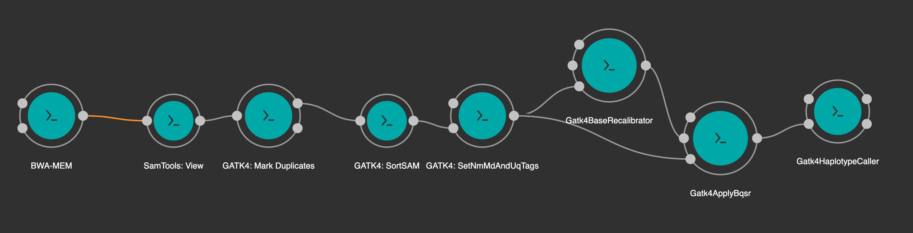

# Janis Workshop (1.3)

## Building alignment workflow 

In this stage, we are going to build a simple workflow to align short reads of DNA. This section is specifically modelled from the [GATK4 data processing for variant discovery WDL workflow](https://github.com/gatk-workflows/gatk4-data-processing/blob/master/processing-for-variant-discovery-gatk4.wdl). As discussed before, we've made modifications to simplify the workflow creation, and start with unaligned Fastqs rather than uBAMs. 

This is the full workflow we'll build:




Our workflow will consist of the following steps:

1. Start with a pair of compressed `FASTQ` files,
2. Align these reads using `BWA MEM` into an uncompressed `SAM` file (the _de facto_ standard for short read alignments),
3. Compress this into the binary equivalent `BAM` file using `samtools`, and finally
4. Mark duplicates using `gatk4 MarkDuplicates`. 

These tools already exist within the Janis Tool Registry, you can see their documentation online:

- [BWA MEM](https://janis.readthedocs.io/en/latest/tools/bioinformatics/bwa/bwamem.html) - Aligning our fastqs to the reference genome
- [Samtols View](https://janis.readthedocs.io/en/latest/tools/bioinformatics/samtools/samtoolsview.html)
- [GATK4 MarkDuplicates](https://janis.readthedocs.io/en/latest/tools/bioinformatics/gatk4/gatk4markduplicates.html)

## Creating our file

A Janis workflow is a Python script, so we can start by creating a file called `preprocessing.py` and importing Janis.

Use a text editor to edit `part1/preprocessing.py` file.

You'll see there already a number of imports for you, Let's go through them:

```python
from janis_core import WorkflowBuilder, String

# Import bioinformatics types
from janis_bioinformatics.data_types import FastqGzPairedEnd, FastaWithIndexes

# Import bioinformatics tools
from janis_bioinformatics.tools.bwa import BwaMemLatest
from janis_bioinformatics.tools.samtools import SamToolsView_1_9
from janis_bioinformatics.tools.gatk4 import (
    Gatk4MarkDuplicates_4_1_4,
    Gatk4SortSam_4_1_4,
    Gatk4SetNmMdAndUqTags_4_1_4,
)
```

- From `janis_core` library, we've imported the `WorkflowBuilder` and `String` types
- From `janis_bioinformatics.data_types`, we've imported `FastqGzPairedEnd` and `FastaWithIndexes`
- We've imported the four tools:
    - `BwaMemLatest` from `bwa`
    - `SamToolsView_1_9` from `samtools`
    - `Gatk4MarkDuplicates_4_1_4` from `gatk4`
    - `Gatk4SortSam_4_1_4` from `gatk4`
    - `Gatk4SetNmMdAndUqTags_4_1_4` from `gatk4`

## Importing additional data_type

We'll import additional data_type to handle our Bam output. Add the following line to the file:

```python
from janis_bioinformatics.data_types import Bam
```

## Declaring our workflow

We'll create an instance of the [`WorkflowBuilder`](https://janis.readthedocs.io/en/latest/references/workflow.html#janis.Workflow) class, this just requires a name for your workflow (can contain alphanumeric characters and underscores).

```python
w = WorkflowBuilder("preprocessingWorkflow")
```

A workflow has 3 methods for building workflows:

- `workflow.input` - Used for creating inputs,
- `workflow.step` - Creates a step on a workflow,
- `workflow.output` - Exposes an output on a workflow.

We give each input / step / output a unique identifier, which then becomes a node in our workflow graph. We can refer to the created node using _dot-notation_ (eg: `w.input_name`). We'll see how this works in the later sections.

More information about each step will be linked from this page about the [`Workflow` and `WorkflowBuilder` class](https://janis.readthedocs.io/en/latest/references/workflow.html).


### Creating inputs on a workflow

> Further reading: [Creating an input](https://janis.readthedocs.io/en/latest/references/workflow.html#creating-an-input)

To create an input on a workflow, you can use the `Workflow.input` method, which has the following structure:

```python
Workflow.input(
    identifier: str, 
    datatype: DataType, 
    default: any = None, 
    doc: str = None
)
```

An input requires a unique identifier (string) and a DataType (String, FastqGzPair, etc). We have four inputs we want to expose on this workflow.

1. Sequencing Reads (`FastqGzPairedEnd` - paired end sequence)
2. Sample name (`String`)
3. Read group header (`String`)
4. Reference files (`FastaWithIndexes`) - `Fasta` + index files)

To add these input definitions to the workflow, add the following lines to your code:

```python
w.input("sample_name", String)
w.input("read_group", String)
w.input("fastq", FastqGzPairedEnd)
w.input("reference", FastaWithIndexes)
```

### Declaring our steps and connections

> Further reading: [Creating a step](https://janis.readthedocs.io/en/latest/references/workflow.html#creating-a-step)

Similar to exposing inputs, we create steps with the `Workflow.step` method. It has the following structure:

```python
Workflow.step(
    identifier: str, 
    tool: janis_core.tool.tool.Tool, 
    scatter: Union[str, List[str], ScatterDescription] = None, 
)
```

We provide a identifier for the step (unique amongst the other nodes in the workflow), and intialise our tool, passing our inputs of the step as parameters.

We can refer to an input (or previous result) using the dot notation. For example, to refer to the `fastq` input, we can use `w.fastq`.

#### BWA MEM

We use [bwa mem's documentation](https://janis.readthedocs.io/en/latest/tools/bioinformatics/bwa/bwamem.html) to determine that we need to provide the following inputs:

- `reads`: `FastqGzPair`            (connect to `w.fastq`)
- `readGroupHeaderLine`: `String`   (connect to `w.read_group`)
- `reference`: `FastaWithDict`      (connect to `w.reference`)
- `markShorterSplits`: `True`

> _The -M flag (`markShorterSplits`) causes BWA to mark shorter split hits as secondary (essential for Picard compatibility)._ [(howto) Map and mark duplicates](https://gatkforums.broadinstitute.org/gatk/discussion/2799/howto-map-and-mark-duplicates)

To add BWA MEM step to your workflow, add the following step definition to your code:

```python
w.step(
    "bwamem",   # step identifier
    BwaMemLatest(
        reads=w.fastq,
        readGroupHeaderLine=w.read_group,
        reference=w.reference,
        markShorterSplits=True,
    )
)
```

#### Samtools view

We'll use a very similar pattern for Samtools View, except this time we'll reference the output of `bwamem`. From bwa mem's documentation, there is one output called `out` with type `Sam`. We'll connect this to `SamtoolsView` only input, called `sam`.
Add the following step definition to your code:

```python
w.step(
    "samtoolsview",
    SamToolsView_1_9(
        sam=w.bwamem.out
    )
)
```

#### Mark Duplicates

Now that we have an aligned BAM file, we can use `gatk4 MarkDuplicates`. MarkDuplicates requires sorted inputs so the secondary and supplementary reads get marked correctly. The output of BWA is _query-grouped_, using `assumeSortOrder="queryname"` is good for MarkDuplicates [[source](https://github.com/gatk-workflows/gatk4-data-processing/blob/3d0faa426d43098003050a445e17127cee025389/processing-for-variant-discovery-gatk4.wdl#L464-L466)].

Janis will automatically generate a filename for the metrics file, so we don't need to provide that.

Hence, we'll provide MarkDuplicates the following params:

- `bam`: Output of `samtoolsview.out`
- `assumeSortOrder` the value `"queryname"`:https://gatkforums.broadinstitute.org/gatk/discussion/2799/howto-map-and-mark-duplicates


Add the following step definition to your code:
```python
w.step(
    "markduplicates",
    Gatk4MarkDuplicates_4_1_4(
        bam=w.samtoolsview.out, 
        assumeSortOrder="queryname"
    ),
)
```

### Exposing outputs

> Further reading: [Creating an output](https://janis.readthedocs.io/en/latest/references/workflow.html#creating-an-output)

Outputs have a very similar syntax to both inputs and steps, they take an `identifier` and a named `source` parameter. Here is the structure:

```python
Workflow.output(
    identifier: str,
    datatype: DataType = None,
    source: Node = None,
    output_folder: List[Union[String, Node]] = None,
    output_name: Union[String, Node] = None
)
```

Often, we don't want to specify the output data type, because we can let Janis do this for us. We'll talk about the `output_folder` and `output_name` in the next few sections. For now, we just have to specify an output identifier and a source.

We'll add an output called `tmp_bamoutput`, and use `markduplicates.out` as the source.
To add this output to your workflow, add the following line to your code:

```python
w.output("tmp_out_unsortedbam", Bam, source=w.markduplicates.out)
```

#### Let's test what we have!

Now that we've implemented part of our workflow, let's test that it's working so far! 

##### Translating to WDL

Although we're using CWL to run the tools, because we've written out analysis in Janis, we can also translate to WDL for free! You can translate your workflow to Janis using:

```bash
# in bash now
janis translate part1/preprocessing.py wdl
```

```wdl
version development

import "tools/bwamem_v0_7_15.wdl" as B
import "tools/SamToolsView_1_9_0.wdl" as S
import "tools/Gatk4MarkDuplicates_4_1_4_0.wdl" as G

workflow preprocessingWorkflow {
  input {
    String sample_name
    String read_group
    Array[File] fastq
    File reference
    File reference_fai
    File reference_amb
    File reference_ann
    File reference_bwt
    File reference_pac
    File reference_sa
    File reference_dict
    Boolean? bwamem_markShorterSplits = true
    String? markduplicates_assumeSortOrder = "queryname"
  }
  call B.bwamem as bwamem {
    input:
      reference=reference,
      reference_amb=reference_amb,
      reference_ann=reference_ann,
      reference_bwt=reference_bwt,
      reference_pac=reference_pac,
      reference_sa=reference_sa,
      reads=fastq,
      readGroupHeaderLine=read_group,
      markShorterSplits=select_first([bwamem_markShorterSplits, true])
  }
  call S.SamToolsView as samtoolsview {
    input:
      sam=bwamem.out
  }
  call G.Gatk4MarkDuplicates as markduplicates {
    input:
      bam=[samtoolsview.out],
      assumeSortOrder=select_first([markduplicates_assumeSortOrder, "queryname"])
  }
  output {
    File tmp_out_unsortedbam = markduplicates.out
  }
}
```

> You can export the CWL translation too!


We're looking good! Now let's run the worfklow using Janis and CWLTool. We'll include the `--development` flag, as when we re-run the pipeline, it won't recompute steps we've already ran!

```bash
janis run -o part1 --development --keep-intermediate-files \
    part1/preprocessing.py \
    --fastq data/BRCA1_R*.fastq.gz \
    --reference reference/hg38-brca1.fasta \
    --sample_name NA12878 \
    --read_group "@RG\tID:NA12878\tSM:NA12878\tLB:NA12878\tPL:ILLUMINA"
```

Hopefully we got `Task has finished with status: Completed`. We can check out output directory:

```bash
$ ls -lgh part1/
# drwxr-xr-x  288B Jul 16 16:50 janis
# -rw-r--r--  1.4K Jul 16 16:49 preprocessing_solution.py
# -rw-r--r--  411B Jul 16 13:15 preprocessing.py
# -rw-r--r--  2.6M Jul 16 16:50 tmp_out_unsortedbam.bam
```

We see the `tmp_out_unsortedbam.bam` which is the BAM output of mark duplicates. 

#### Preparing for next exercise

Once you are happy with this task, you can now remove the `tmp_out_unsortedbam.bam` output we created in this section.

[Next >](4-janis-data-preprocessing.md)


